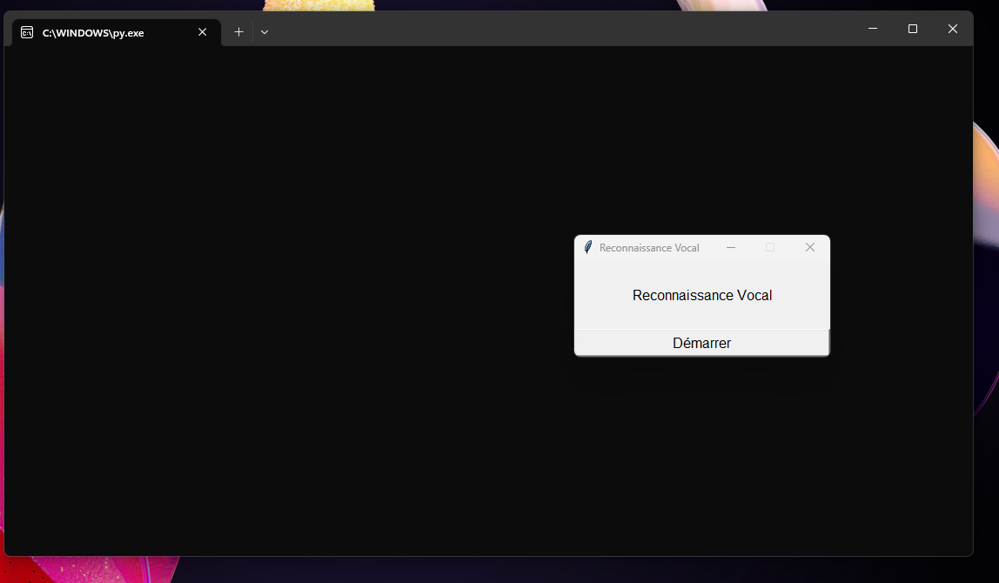

# Reconnaissance Vocale sur Windows BETA

**MISE A JOUR : 22/08/23**

Le projet permet de détecter la voix de l'utilisateur pour exécuter des actions / taches sur windows

> **Note: le projet est une ébauche, il est toujours en developpement**

## Démarrage

**Pour le moment, il n'y a pas de fichier exécutable donc pour utiliser le projet il faut télécharger le code source**

Après avoir téléchargé le projet, vous lancerez le fichier **Gui.py**  
Il y a un menu qui va apparaitre sur l'ecran nommé "Reconnaissance Vocal" Comme ceci :

Puis vous appuyez sur **Démarrer** et la reconnaissance vocale se demarre

## Librairie Python
Pour que le projet fonctione il faut installer :
[**speech_recognition**](https://pypi.org/project/SpeechRecognition/)

## Commande Vocale
Voici des commandes vocales que vous devez dire pour executer les actions :  
A chaque debut phrase, vous devez dire **"ok windows"** puis dire votre suggestion 

**"lance"** ou **"démarre"** : permet de lancer un logiciel  
- ***exemple: "ok windows lance discord"*** discord se lancera automatiquement
- Logiciel disponible :
    - Discord
    - Spotify

> **Notre : D'autre logiciel vont etre ajouté au fur à mesure du temps**

**"recherche"** : permet de rechercher sur Internet selon votre platforme ci dessous que **vous direz à la fin** : 
* Pour rechercher sur Google : **"sur Internet"** ou **"sur google"** 
* Pour rechercher sur Youtube : **"sur Youtube"**
